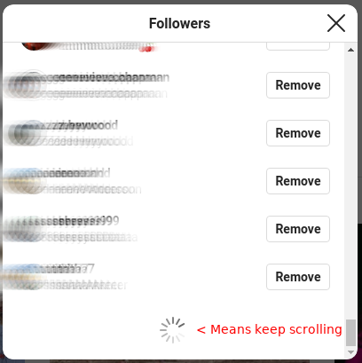

# Instagram Wrapped
Summary statistics for your Instagram account.
*Currently supported*: see who doesn't follow you back

## How-to:
### 1. Download the list of your followers
Go to your Instagram profile **on desktop** and click to see your list of *Followers*


Scroll to the **VERY BOTTOM** of the list --- make sure there is **no** loading icon at the bottom


Press `Command + s` to save the whole webpage --- save it as `followers.html` inside of your `Downloads` folder
### 2. Download the list of people you follow
Repeat Step 1 for your Instagram *Following* tab. This time, save the file as `following.html`.  
After this, your `Downloads` folder should contain the following:


### 3. Run this program (macOS or Linux)
Once your files have been downloaded:
1. Open the program called `Terminal` --- it comes pre-installed with macOS, you can find it in applications
2. Copy and paste the following into your `Terminal` window:  
```
cd ~/Downloads && curl https://raw.githubusercontent.com/mkatzef/instagram-wrapped/master/main.py | python
```  
3. Press `Enter`  

#### That's it!
You should see two lists of names appear:
* People who don't follow you
* People you don't follow


### Notes:
**Always inspect the code you're running from others on github!**  
However, I assure you:
* This program doesn't save any of your information
* This program never gets access to your Instagram account

Tested using web browsers Google Chrome and Mozilla Firefox on Ubuntu Linux
